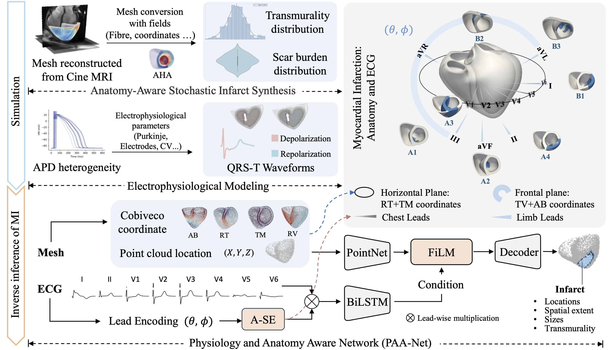

# PAA-Net for Cardiac Digital Twin MI Inference

This repository contains the code for **Physiology and Anatomy Aware Inverse Inference of Myocardial Infarction for Cardiac Digital Twin**.

## Overview

The pipeline has two main stages:

1. **Simulation**
   - Mesh conversion with fields, involving from surface mesh to volume mesh, fibre generation, cobiveco coordinate computation, are all based on the open-source [InSilicoHeartGen](https://github.com/rdoste/InSilicoHeartGen) framwork.
   - ECG (QRS-T) Simulation is based on the open-source [Cardiac-Digital-Twin](https://github.com/juliacamps/Cardiac-Digital-Twin) framework.
   - Anatomy-Aware Stochastic Infarct Synthesis

2. **Inverse inference of MI**
   - Encodes 3D ventricular geometry and 8-lead ECG signals and then fuses ECG and geometry features to predict normal myocardium, scar core, and border zone.


## Citation

If you use this code, please cite:

```bibtex
@misc{wang2026physiologyanatomyawareinverse,
      title={Physiology and Anatomy Aware Inverse Inference of Myocardial Infarction for Cardiac Digital Twin}, 
      author={Mengxiao Wang and Yilin Lyu and Julia Camps and Ching Hui Sia and Mark Yan-Yee Chan and Yanrui Jin and Shuzhi Sam Ge and Chengliang Liu and Lei Li},
      year={2026},
      eprint={2605.22044},
      archivePrefix={arXiv},
      primaryClass={cs.CV},
      url={https://arxiv.org/abs/2605.22044}, 
}
```

```bibtex
@article{campsHarnessing12leadECG2024,
  title = {Harnessing 12-Lead {{ECG}} and {{MRI}} Data to Personalise Repolarisation Profiles in Cardiac Digital Twin Models for Enhanced Virtual Drug Testing},
  author = {Camps, Julia and Wang, Zhinuo Jenny and Doste, Ruben and Berg, Lucas Arantes and Holmes, Maxx and Lawson, Brodie and Tomek, Jakub and Burrage, Kevin and Bueno-Orovio, Alfonso and Rodriguez, Blanca},
  date = {2024-10-18},
  journaltitle = {Medical Image Analysis},
  shortjournal = {Med. Image Anal.},
  pages = {103361},
  issn = {1361-8415},
  doi = {10.1016/j.media.2024.103361},
  
}

```

## Acknowledgements

This work builds on[rdoste/InSilicoHeartGen](https://github.com/rdoste/InSilicoHeartGen) and [juliacamps/Cardiac-Digital-Twin](https://github.com/juliacamps/Cardiac-Digital-Twin), for cardiac digital twin modeling, Please also cite the relevant upstream methods if you use the simulation or model components.